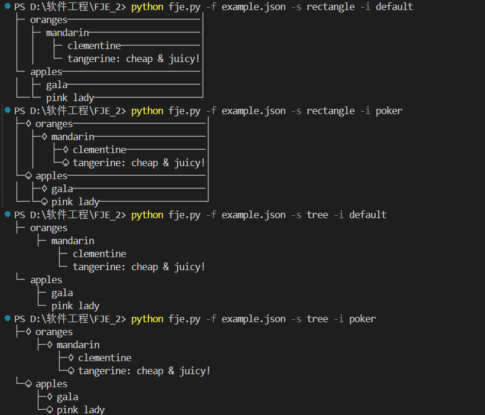

# fje2
运用迭代器+策略模式重构版本
迭代器如下:
```python
class JsonIterator:
    def __init__(self, json_data):
        self.stack = [(None, json_data,0)]
        
    def __iter__(self):
        return self
    
    def __next__(self):
        if not self.stack:
            raise StopIteration
        
        key, value, level = self.stack.pop()
        if isinstance(value, dict):
            for k, v in reversed(list(value.items())):
                self.stack.append((k, v, level + 1))
            return key, None, level
        elif isinstance(value, list):
            for v in reversed(value):
                self.stack.append((None, v, level + 1))
            return key, None, level
        else:
            return key, value, level

```
策略模式体现在通过FJE_context文件中的FunnyJsonExplorer类进行策略的读取，来选择不同的策略来创建对应风格类来进行显示。
