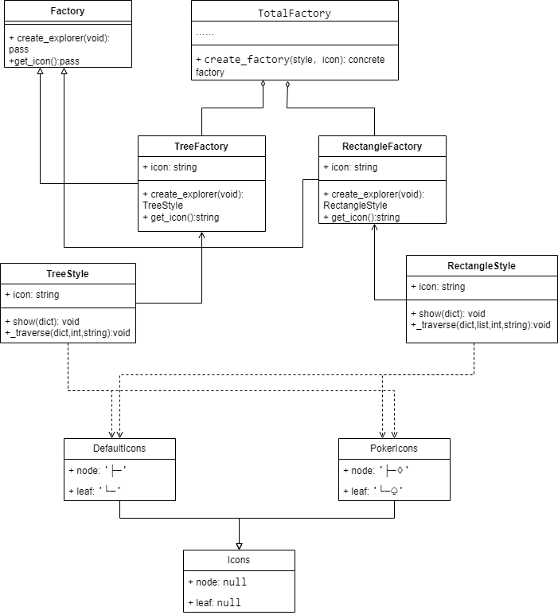
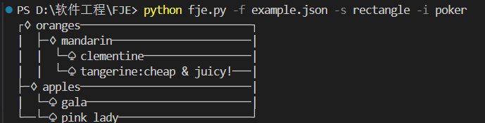

# 软工design pattern习题
21307283曾尚睿

## 作业要求
Funny JSON Explorer（**FJE**），是一个JSON文件可视化的命令行界面小工具
基于需求描述和领域模型，按照设计模式要求，进行软件设计，并编码实现（任何语言均可）。
### 设计模式
使用**工厂方法**（Factory）、**抽象工厂**（Abstract Factory）、**建造者**（Builder）模式、**组合模式**（Composition），完成功能的同时，使得程序易于扩展和维护。
（必做）：不改变现有代码，只需添加新的抽象工厂，即可添加新的风格
### 类图：

### 设计模式
这次实验我采用了工厂方法来进行设计。将两种style视作工厂生产的商品，TreeFactory和RectangleFactory继承了Factory基类，分别创建自己风格的展示器。然后通过展示器对不同icon的使用，达成了设计目的。并为了客户端更方便调用，通过了一个总的类和静态方法来实现对类内代码的分离。
其中DefaultIcons和PokerIcons继承于Icons基类。
若想达到必做的要求，则需继承Factory，添加新的工厂，然后在styles.py下增加新的逻辑来达成风格，通过新工厂来创建新的风格。跟另外两个风格不同的主要是traverse和show函数的逻辑。除此之外，需要在TotalFactory中增加返回新工厂的选项。
使用方法：
```
python fje.py -f example.json -s tree -i poker
```
-i 可选poker或default
-s 可选tree或rectangle



